# Java Micro Web Server and IoC Framework

**Student:** Daniel Rodriguez

This repository contains a lightweight Java web server and a minimal IoC-style framework built with Java reflection.
It supports dynamic `GET` endpoints using annotations and static file serving for `.html` and `.png` resources.

## Objective

Build a minimal prototype that demonstrates Java reflection capabilities by loading POJOs as web components and exposing their methods as HTTP endpoints.

The project addresses the lab requirements:

- Handle multiple non-concurrent requests.
- Serve static files (`.html`, `.png`).
- Implement annotation-driven web components (`@RestController`, `@GetMapping`, `@RequestParam`).
- Support first-version controller loading from command line.
- Support final-version auto-discovery of controllers in the root package.

## Key Definitions and Important Aspects

### Key Definitions

- **Web Server:** Program that listens on a TCP port and serves HTTP responses.
- **IoC (Inversion of Control):** Pattern where framework code controls component lifecycle and invocation.
- **POJO:** Plain Old Java Object used here as controller components.
- **Route:** Mapping between a URI path and a Java method.
- **Reflection:** Java mechanism used to inspect annotations and invoke methods dynamically.
- **Static File:** Resource served directly without business logic execution.

### Important Aspects

1. **Reflection-based routing:** Endpoints are discovered from annotations at runtime.
2. **Simple HTTP contract:** Only `GET` is required for this lab scope.
3. **Progressive delivery:** First CLI-based bean loading, then package scanning.
4. **Static and dynamic integration:** Same server handles API routes and static resources.
5. **Maven structure and reproducibility:** Build and run instructions are consistent and portable.

## What Is Implemented

### 1) Dynamic controllers with annotations

- `@RestController` marks a class as component.
- `@GetMapping("/path")` maps methods to routes.
- `@RequestParam(value="name", defaultValue="World")` binds query parameters.

### 2) Reflection-based invocation

- Controllers are loaded dynamically.
- Methods are validated (`String` return type, supported parameters).
- Method invocation resolves query parameters at runtime.

### 3) Static file serving

- Static files are loaded from `src/main/resources/public`.
- Supported content types in this implementation:
	- `text/html; charset=UTF-8`
	- `image/png`

### 4) Two loading modes

- **First version (lab suggestion):** load one controller class from CLI.
- **Final version:** scan root package and load all classes annotated with `@RestController`.

## Architecture

Core classes in `co.edu.escuelaing.reflexionlab`:

- `MicroSpringBoot`: framework bootstrap, controller scanning/loading, and HTTP server internals.
- `HelloController`: sample endpoint for `/`.
- `GreetingController`: sample endpoint for `/greeting` with `@RequestParam`.
- `Main`: simple entrypoint that delegates to `MicroSpringBoot`.
- `GetMapping`, `RequestParam`, `RestController`: custom annotations.

## How to Run

### Prerequisites

- Java 17+
- Maven 3.8+

### Build

```bash
mvn clean package
```

### Run (Final version: auto-scan)

```bash
java -cp target/classes co.edu.escuelaing.reflexionlab.Main
```

### Run (First version: single controller from CLI)

```bash
java -cp target/classes co.edu.escuelaing.reflexionlab.MicroSpringBoot co.edu.escuelaing.reflexionlab.HelloController
```

Server starts on:

- `http://localhost:8080`

## Test Examples Performed

### Dynamic endpoint test: root

Request:

- `http://localhost:8080/`

Expected response:

- `Greetings from Spring Boot!`

### Dynamic endpoint test: greeting default

Request:

- `http://localhost:8080/greeting`

Expected response:

- `Hola World`

### Dynamic endpoint test: greeting with query parameter

Request:

- `http://localhost:8080/greeting?name=Daniel`

Expected response:

- `Hola Daniel`

### Static file test: HTML

Request:

- `http://localhost:8080/index.html`

Expected response:

- HTTP 200 + HTML content

### Static file test: PNG

Request:

- `http://localhost:8080/logo.png`

Expected response:

- HTTP 200 + PNG image

## AWS Deployment Evidence

### 1) EC2 Instance Information

- Instance ID: `i-06921e3251a955f2d`
- Public IPv4: `100.48.207.105`
- OS: Amazon Linux 2023
- Open application port: `8080`

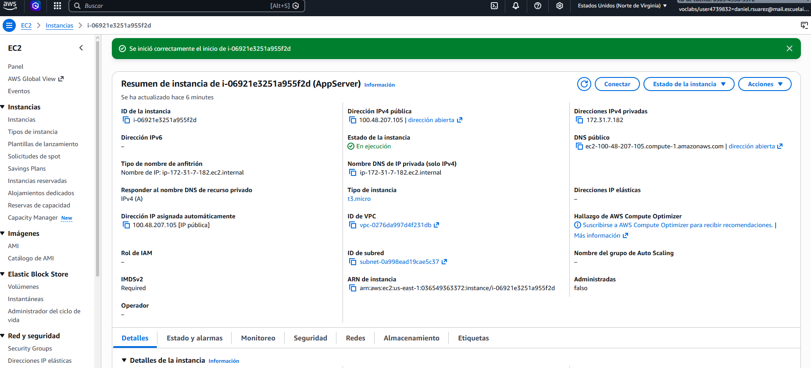

### 2) Build the Project Locally

```bash
mvn clean package
```

### 3) Upload JAR to EC2

```bash
scp -i "C:\Users\ders1\Downloads\cloudec2primer\AppServerKey.pem" "C:\Users\ders1\OneDrive\Documentos\gthub\Daniel-Rodriguez-Taller-de-Arquitecturas-de-Servidores-de-Aplicaciones\target\reflexionlab-1.0.0-SNAPSHOT.jar" ec2-user@100.48.207.105:~/
```

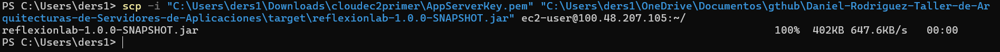

### 4) Connect by SSH and Run the Application

```bash
ssh -i "C:\Users\ders1\Downloads\cloudec2primer\AppServerKey.pem" ec2-user@100.48.207.105
java -jar ~/reflexionlab-1.0.0-SNAPSHOT.jar
```

Expected server log:

- `Micro server running on http://localhost:8080`

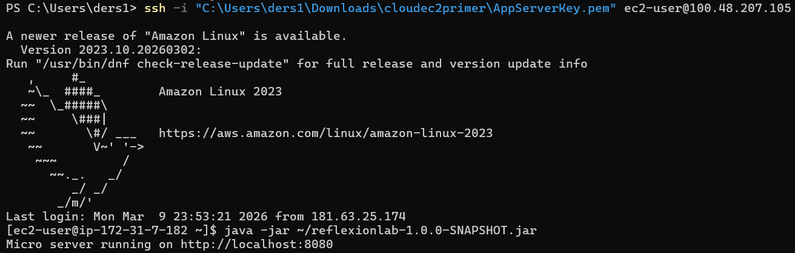

### 5) Security Group Configuration

Inbound rules required:

- SSH (`22`) from your IP
- Custom TCP (`8080`) from `0.0.0.0/0`

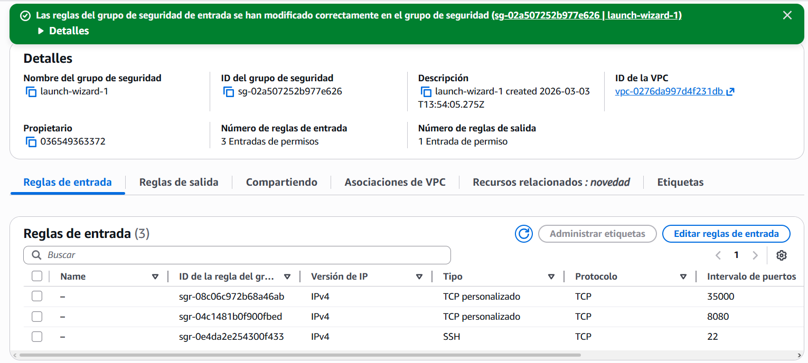

### 6) Remote Validation (Public Access)

Test URLs:

- `http://100.48.207.105:8080/`
- `http://100.48.207.105:8080/greeting?name=Daniel`
- `http://100.48.207.105:8080/index.html`
- `http://100.48.207.105:8080/logo.png`

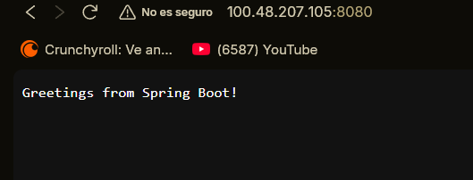

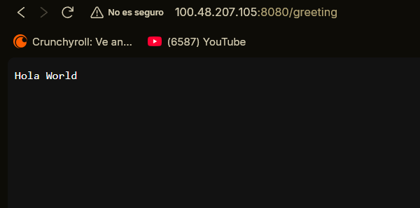

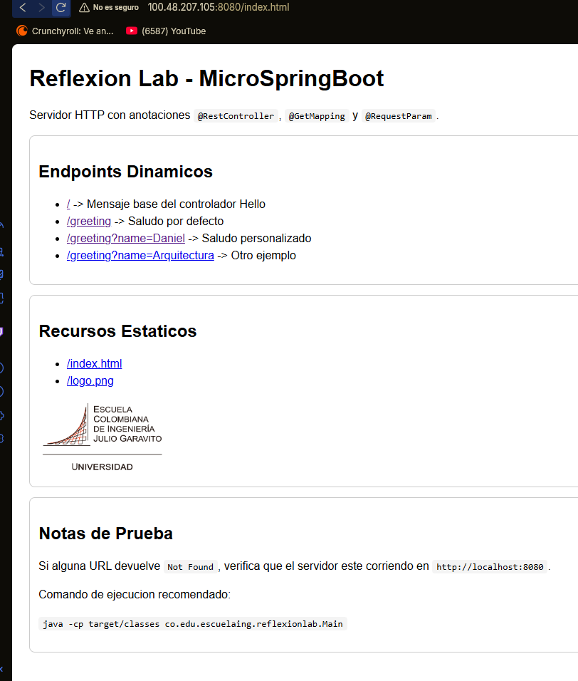


### 7) Commit Deployed to EC2

```bash
git rev-parse --short HEAD
```

Deployed commit hash:

- Deployed commit hash (full): a1bb2ecf207f3a08be8490514670ec246d6b0508

## Evidence

### 1) Running Server in Terminal

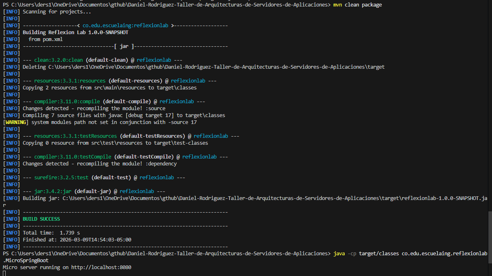

### 2) `/` Response

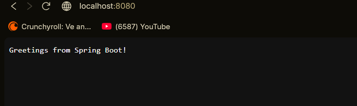

### 3) `/greeting?name=Daniel` Response

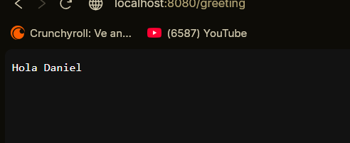

### 4) `/index.html` and `/logo.png` Static Files

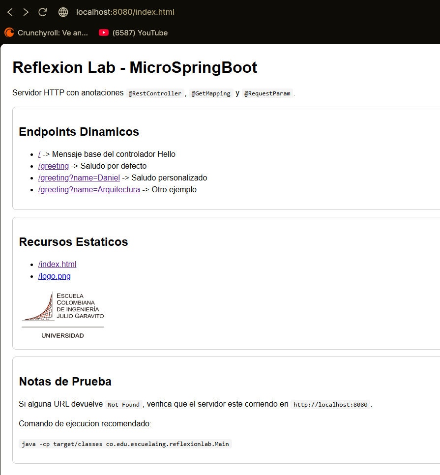

## Repository Structure

```text
.
|-- pom.xml
|-- README.md
`-- src
		|-- main
		|   |-- java
		|   |   `-- co/edu/escuelaing/reflexionlab
		|   |       |-- Main.java
		|   |       |-- MicroSpringBoot.java
		|   |       |-- HelloController.java
		|   |       |-- GreetingController.java
		|   |       |-- RestController.java
		|   |       |-- GetMapping.java
		|   |       `-- RequestParam.java
		|   `-- resources
		|       `-- public
		|           |-- index.html
		|           `-- logo.png
		`-- test
				|-- java
				`-- resources
```

## Conclusions

1. A minimal HTTP server can be extended into an annotation-driven micro framework using Java reflection.
2. Reflection enables dynamic endpoint discovery and invocation while keeping user code simple.
3. Query parameter binding with defaults is enough to demonstrate practical request handling.
4. Serving static resources and dynamic routes from the same server improves assignment completeness.
5. The project is intentionally simple, but it already demonstrates core distributed-systems concepts.

## Technologies

- Java 17
- Maven
- Git

## References

- Java Networking (`ServerSocket`, `Socket`, `URI`)
- Java I/O (`BufferedReader`, `InputStream`, `OutputStream`)
- Java Reflection API
- Maven documentation: https://maven.apache.org/
